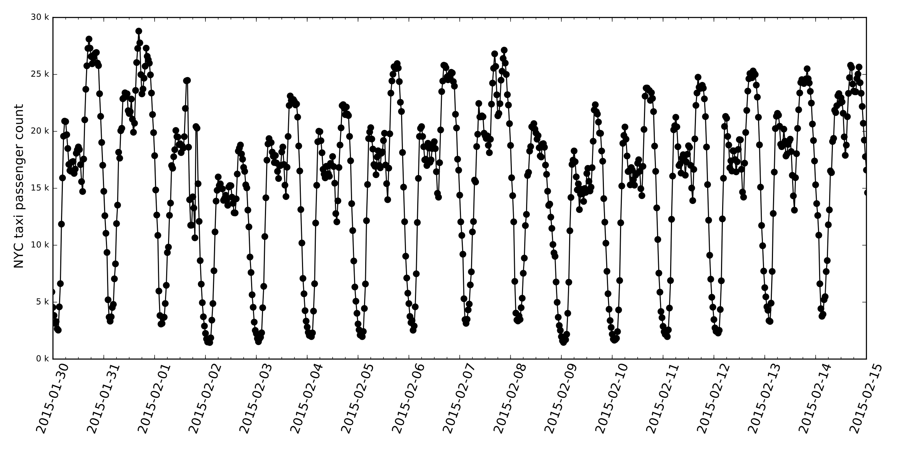

# RNN-Time-series-Anomaly-Detection
Anomaly detector model consisting of two-stage strategy of time-series prediction and anomaly score calculation

## Requirements
* Python 3.5+
* Numpy
* Matplotlib
* pandas
## Dataset
* NYC taxi passenger count
 * Prediction of the New York City taxi passenger data. left.
Example portion of taxi passenger data (aggregated at 30 min
intervals).
  * public data stream provided by the [New
York City Transportation Authority](http://www.nyc.gov/html/tlc/html/about/trip_record_data.shtml )
  * preprocessed (aggregated at 30 min intervals) by Cui, Yuwei, et al. in ["A comparative study of HTM and other neural network models for online sequence learning with streaming data." Neural Networks (IJCNN), 2016 International Joint Conference on. IEEE, 2016.](http://ieeexplore.ieee.org/abstract/document/7727380/)
  , [code](https://github.com/numenta/htmresearch/tree/master/projects/sequence_prediction)

* Electrocardiogram (ECG)

## Implemented Algorithms
* RNN based Multi-step predictor
* Multivariate Gaussian distribution based anomaly detector

## Example of usage
Train and save RNN based time-series prediction model:

    python 1_train_predictor_ecg.py
    python 1_train_predictor_nyc.py

 performance comparison:

    python plotResults.py

## Result
* Prediction from stacked RNN

* Performance comparison
  * FOS-ELM and proposed variants including OR-ELM

## To do
* Rewrite this code with Pytorch for GPU acceleration

